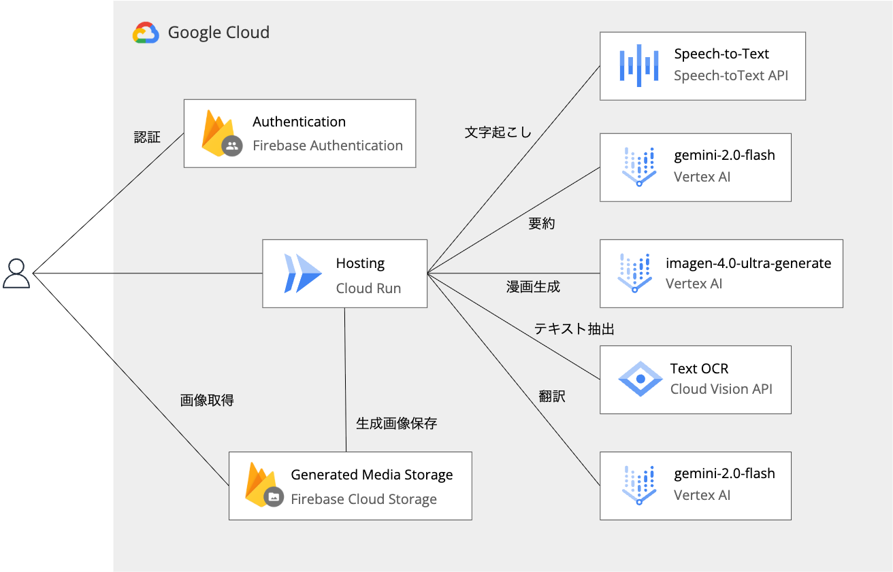

# MangaMaker: 会議議事録を 4 コマ漫画に変換する AI エージェント

## はじめに

会議の議事録って、読むのも書くのも面倒ですよね。長い文章を読み返すのは時間がかかるし、重要なポイントが埋もれてしまうことも。そんな課題を解決するために、**会議の議事録（テキストや音声）を 4 コマ漫画に自動変換する Web アプリケーション「MangaMaker」**を開発しました。

Google Cloud の AI サービスを組み合わせて、音声認識 → 内容要約 → 画像生成 →OCR→ 翻訳という複数の AI 処理を連携させたマルチモーダルな AI エージェントシステムです。

## 解決したい課題

### 従来の議事録の問題点

- **可読性の低さ**: 長文の議事録は読み返すのに時間がかかる
- **情報の埋没**: 重要なポイントが文章の中に埋もれてしまう
- **共有の困難さ**: テキストベースの議事録は興味を引きにくい
- **言語の壁**: 多言語チームでの情報共有が困難

### MangaMaker の解決アプローチ

4 コマ漫画という視覚的でわかりやすい形式に変換することで、これらの課題を一挙に解決します。漫画形式なら：

- 一目で内容が理解できる
- 重要なポイントが視覚的に強調される
- 楽しく読める・共有しやすい
- 画像なので言語を超えて理解しやすい

## システム アーキテクチャ

MangaMaker は、Google Cloud の AI サービスを中核とした多層的なアーキテクチャで構成されています。

### 技術スタック

- **フロントエンド**: React Router 7, TypeScript
- **バックエンド**: React Router 7
- **AI サービス**:
  - Google Cloud Speech-to-Text API（音声認識）
  - Gemini 2.0（テキスト要約・対話生成）
  - Imagen 4.0（画像生成）
  - Google Cloud Vision API（OCR）
- **認証・ストレージ**: Firebase Authentication, Firebase Cloud Storage
- **ホスティング**: Cloud Run

### 処理フローアーキテクチャ

### 主要コンポーネント

#### 1. ストリーミング処理パイプライン

リアルタイムでユーザーに進捗を通知しながら、以下の処理を順次実行：

- 音声ファイルのアップロード・変換
- Gemini 2.0 による内容の要約と 4 コマ構成の生成
- Imagen 4.0 による各コマの画像生成
- OCR 処理によるテキスト抽出
- 必要に応じた翻訳処理

#### 2. マルチモーダル画像処理

- Canvas API を使用した高精度なテキストマスキング
- フォントレンダリングと配置計算
- 画像の合成・オーバーレイ処理

#### 3. Vision Service

- Google Cloud Vision API との統合
- OCR によるテキスト検出と位置情報の取得
- テキスト領域の正確な特定

#### 4. 翻訳サービス

- 多言語対応のためのテキスト翻訳
- OCR で抽出したテキストの自動翻訳

## デモ動画・使用例

### 基本的な使用フロー

1. **入力**: テキストまたは音声ファイルをアップロード
2. **処理**: AI が自動で内容を分析し、4 コマ漫画を生成
3. **結果**: 生成された漫画をブラウザで表示・ダウンロード
4. **保存**: Firebase Cloud Storage に自動保存

### 実際の変換例

議事録「プロジェクトの進捗について話し合い、スケジュール調整が必要という結論に至った」
↓
4 コマ漫画：

1. チームメンバーが会議室に集合
2. プロジェクトの現状を確認
3. 問題点を発見・議論
4. スケジュール見直しで合意

## スケーラビリティと拡張性

### パフォーマンス最適化

- 画像処理の並列化により処理時間を短縮
- Firebase Cloud Storage による効率的なファイル管理
- クライアント側のキャッシュ機能

### 将来の拡張計画

- **カスタマイズ機能**: キャラクターや背景のカスタマイズ
- **多言語対応の強化**: より多くの言語での入出力対応
- **API 化**: 他のアプリケーションからの利用を可能に
- **企業向け機能**: 組織内での共有・管理機能

## 苦労した点

- 日本語化: Imagen 4.0 で日本語がうまく出力されないので、OCR を使ってテキストを抽出し、翻訳してから画像にオーバーレイする処理を追加した。吹き出しの中にテキストが含まれるようプロンプトを作成して、オーバーレイした時の違和感が小さくなるようにした。
- 4 コマを生成しやすいように、出力フォーマット指定、起承転結での要約などプロンプトを工夫した

## まとめ

MangaMaker は、Google Cloud の AI サービスを効果的に組み合わせることで、従来の議事録の課題を創造的に解決する AI エージェントシステムです。

### プロジェクトの意義

- **実用性**: 実際のビジネス課題を解決
- **革新性**: 議事録 × 漫画という新しいアプローチ
- **技術性**: 複数の AI サービスの統合による高度な処理
- **拡張性**: 様々な用途への応用可能性

テキスト情報の可視化という観点で、AI の可能性を最大限に活用し、ユーザーにとって価値のあるプロダクトを実現できました。今後も継続的な改善を通じて、より多くの人にとって便利なツールとして発展させていきたいと思います。

---

第 2 回 AI Agent Hackathon with Google Cloud への参加作品として開発しました。Google Cloud の AI サービスの可能性を探求し、クリエイティブな解決策を提案できたと考えています。
